# 🤖 Agentic AI Investment Advisor

Agentic AI Investment Advisor powered by **AWS Bedrock AgentCore & Strands Agent & LangGraph**

## 🎯 System Overview

A production-level investment advisory system where 4 specialized AI agents collaborate to provide personalized investment portfolio recommendations.

## 🏗️ Overall System Architecture


## 🏗️ Detailed Agent Architecture

### Lab 1: Financial Analyst
**Role**: Personal financial situation analysis and risk profile assessment


**Architecture**:
- **AgentCore Runtime**: Serverless agent hosting
- **Tools**: Calculator (accurate return calculation)
- **AI Model**: OpenAI GPT-OSS 120B

**Processing Flow**:
1. Analyze user input data (age, investment experience, investment amount, target amount)
2. Calculate required annual return using Calculator tool: `((target_amount/investment_amount)-1)*100`
3. Assess risk profile considering age and experience (Conservative/Neutral/Aggressive)
4. Recommend investment sectors based on personal preferences

**Output**:
```json
{
  "risk_profile": "Aggressive",
  "required_annual_return_rate": 40.0,
  "key_sectors": ["Growth Stocks", "Technology Stocks", "Global Equities"],
  "summary": "Aggressive investment strategy required to achieve 40% target return"
}
```

### Lab 2: Portfolio Architect
**Role**: Optimal portfolio design based on real-time ETF data


**Architecture**:
- **AgentCore Runtime**: Main portfolio design agent
- **MCP Server Runtime**: yfinance API integration (deployed as separate Runtime)
- **Tools**: `analyze_etf_performance`, `calculate_correlation`
- **Authentication**: Cognito JWT OAuth2 (direct Runtime-to-Runtime communication)

**Processing Flow**:
1. Select 5 candidate ETFs based on Financial Analyst results
2. Execute Monte Carlo simulation (1000 iterations) for each ETF
3. Calculate correlation matrix between ETFs (measure diversification effects)
4. Select optimal 3 ETFs considering returns and diversification effects
5. Determine investment weights and evaluate portfolio (profitability/risk management/diversification scores)

**Output**:
```json
{
  "portfolio_allocation": {"QQQ": 50, "SPY": 30, "GLD": 20},
  "reason": "Tech-focused growth strategy...",
  "portfolio_scores": {
    "profitability": {"score": 8, "reason": "High probability of achieving target return"},
    "risk_management": {"score": 7, "reason": "Appropriate volatility level"},
    "diversification": {"score": 9, "reason": "Excellent diversification with low correlation"}
  }
}
```

### Lab 3: Risk Manager
**Role**: Risk scenario analysis based on news and macroeconomic data


**Architecture**:
- **AgentCore Gateway**: Expose Lambda functions as MCP tools
- **Lambda Layer**: yfinance library packaging
- **Lambda Functions**: News/market/geopolitical data retrieval
- **Tools**: `get_product_news`, `get_market_data`, `get_geopolitical_indicators`

**Processing Flow**:
1. Collect and analyze latest 5 news articles for each portfolio ETF
2. Real-time retrieval of 7 major macroeconomic indicators (interest rates, dollar index, VIX, oil, gold, S&P500)
3. Query 5 regional ETFs (China, emerging markets, Europe, Japan, Korea)
4. Synthesize 3 data types to derive 2 key economic scenarios
5. Establish portfolio adjustment strategies for each scenario

**Output**:
```json
{
  "scenario1": {
    "name": "Tech-Led Economic Recovery",
    "probability": "35%",
    "allocation_management": {"QQQ": 70, "SPY": 25, "GLD": 5},
    "reason": "Maximize returns by increasing exposure to technology sector growth"
  },
  "scenario2": {
    "name": "Persistent Inflation and Economic Slowdown", 
    "probability": "25%",
    "allocation_management": {"QQQ": 40, "SPY": 40, "GLD": 20},
    "reason": "Strengthen risk hedging by expanding safe asset allocation"
  }
}
```

### Lab 4: Investment Advisor
**Role**: Integration of 3 agent results and long-term memory management


**Architecture**:
- **LangGraph**: Sequential execution workflow of 3 agents
- **AgentCore Memory**: Automatic consultation history summarization with SUMMARY strategy
- **Agent Invocation**: Direct calls to other 3 agent Runtimes

**Processing Flow**:
1. **Sequential Agent Execution**:
   - `financial_node` → Invoke Financial Analyst Runtime
   - `portfolio_node` → Invoke Portfolio Architect Runtime  
   - `risk_node` → Invoke Risk Manager Runtime
2. **Real-time Streaming**: Display each agent's reasoning process and tool usage in real-time
3. **Memory Storage**: Save each agent's results as session-based conversation events
4. **Automatic Summarization**: SUMMARY strategy structures and summarizes entire consultation sessions by topics

**Memory Structure**:
- **Short-term**: Store each agent's results as session-based conversations (7 days)
- **Long-term**: SUMMARY strategy generates topic-structured summaries (permanent preservation)
- **Namespace**: `investment/session/{sessionId}` structure

## 🔧 Technical Implementation Details

### AgentCore 서비스 활용

**1. Runtime (Agent) - 에이전트 호스팅**
- 각 AI 에이전트를 독립적인 서버리스 함수로 배포
- 자동 스케일링 및 고가용성 보장
- ECR 컨테이너 이미지 기반 배포

**2. Runtime (MCP Server) - 데이터 서버 호스팅**
- yfinance 기반 ETF 데이터 조회 서버를 서버리스로 배포
- MCP 프로토콜로 AI 도구화
- 실시간 금융 데이터 제공

**3. Gateway - Lambda 함수를 MCP 변환**
- Lambda 함수를 AI가 사용할 수 있는 MCP 도구로 변환 (Risk Manager에서 사용)
- Cognito JWT 인증으로 보안 강화
- 복잡한 Lambda 인프라를 간단한 AI 도구로 추상화

**4. Memory - 장기 메모리 및 개인화**
- SUMMARY 전략으로 상담 세션 자동 요약
- 사용자별 투자 히스토리 장기 보존
- 개인화된 투자 서비스 제공 기반

**5. Observability - 모니터링 및 추적**
- 각 에이전트의 성능 및 사용량 모니터링
- 실시간 로그 및 메트릭 수집
- 시스템 최적화를 위한 인사이트 제공

### 데이터 흐름

```
사용자 입력
    ↓
Investment Advisor (LangGraph 오케스트레이션)
    ↓
Financial Analyst (Runtime + OpenAI GPT-OSS 120B)
    ↓ (위험성향, 목표수익률)
Portfolio Architect (Runtime + MCP Server + Claude 4.0 Sonnet)
    ↓ (포트폴리오 배분)
Risk Manager (Runtime + Gateway + Claude 3.7 Sonnet)
    ↓ (리스크 시나리오)
Investment Advisor (Memory 저장 + 최종 통합)
    ↓
최종 투자 가이드 + 자동 요약 저장
```

## 🚀 Quick Start

### 1. Prerequisites

#### AWS Bedrock Model Access Setup (Required)
이 프로젝트는 다음 Bedrock 모델들에 대한 액세스 권한이 필요합니다:

- **OpenAI GPT-OSS 120B** (`openai.gpt-oss-120b-1:0`) - Financial Analyst용
- **Claude 4.0 Sonnet** (`global.anthropic.claude-sonnet-4-20250514-v1:0`) - Portfolio Architect용  
- **Claude 3.7 Sonnet** (`us.anthropic.claude-3-7-sonnet-20250219-v1:0`) - Risk Manager용

**모델 액세스 요청 방법:**
1. AWS 콘솔에서 **Amazon Bedrock** 서비스로 이동
2. 좌측 메뉴에서 **Model access** 클릭
3. 위 3개 모델에 대해 **Request model access** 클릭
4. 승인 완료까지 대기 (보통 몇 분 소요)

#### 리전 설정
모든 리소스는 **us-west-2** 리전에 배포됩니다. `config.py` 파일에서 변경 가능합니다.

### 2. Environment Setup
```bash
git clone <repository-url>
cd investment_advisor_strands
python3 -m venv venv
source venv/bin/activate
pip install -r requirements.txt
aws configure  # us-west-2 리전 설정 권장
```

### 3. Complete Deployment (Recommended)
```bash
python deploy_all.py
```

### 4. Run Web App
```bash
cd investment_advisor && streamlit run app.py
```
Access `http://localhost:8501` in browser

### 5. Complete Cleanup
```bash
python cleanup_all.py
```

## 🎯 사용 시나리오

### 시나리오 1: 전체 시스템 체험 (권장)
1. `python deploy_all.py` - 전체 시스템 배포
2. `cd investment_advisor && streamlit run app.py` - 통합 웹앱 실행
3. 투자 정보 입력 후 4개 에이전트의 협업 과정 실시간 확인
4. 상담 히스토리에서 자동 요약된 과거 상담 기록 확인

### 시나리오 2: 개별 에이전트 학습
1. `cd financial_analyst && python deploy.py && streamlit run app.py`
2. 재무 분석 과정과 Calculator 도구 사용 확인
3. `cd ../portfolio_architect` - 포트폴리오 설계 과정 학습
4. `cd ../risk_manager` - 리스크 분석 과정 학습

### 시나리오 3: 개발 및 커스터마이징
1. 각 에이전트 폴더의 `README.md` 참조하여 상세 구조 파악
2. 개별 배포 및 테스트로 기능 확인 (`deployment_info.json` 파일로 배포 상태 확인)
3. 코드 수정 후 개별 재배포 (각 폴더의 `deploy.py` 실행)
4. 통합 웹앱에서 전체 워크플로우 테스트
5. `shared/` 폴더의 공통 유틸리티 함수 활용하여 새로운 에이전트 개발

## ⚙️ 설정 변경

### 리전 및 공통 설정 변경
모든 배포 스크립트는 루트의 `config.py` 파일에서 공통 설정을 가져옵니다:

```python
# config.py
class Config:
    # AWS 리전 설정 (모든 에이전트에서 공통 사용)
    REGION = "us-west-2"  # 원하는 리전으로 변경
    
    # 에이전트별 이름 설정
    FINANCIAL_ANALYST_NAME = "financial_analyst"
    PORTFOLIO_ARCHITECT_NAME = "portfolio_architect"
    # ... 기타 설정들
```

**설정 변경 후 재배포:**
```bash
# 전체 재배포
python cleanup_all.py  # 기존 리소스 정리
python deploy_all.py   # 새 설정으로 재배포

# 또는 개별 재배포
cd financial_analyst && python deploy.py
```

### Bedrock 모델 변경
각 에이전트의 메인 파일에서 모델 ID를 변경할 수 있습니다:

```python
# financial_analyst/financial_analyst.py
class Config:
    MODEL_ID = "openai.gpt-oss-120b-1:0"  # 다른 모델로 변경 가능
```

## 🔧 기술 스택 및 아키텍처

### 핵심 기술
- **AI Framework**: Strands Agents SDK + LangGraph
- **Infrastructure**: AWS Bedrock AgentCore (Runtime, Gateway, Memory, Observability)
- **LLM**: 
  - Financial Analyst: OpenAI GPT-OSS 120B
  - Portfolio Architect: Claude 4.0 Sonnet (global.anthropic.claude-sonnet-4-20250514-v1:0)
  - Risk Manager: Claude 3.7 Sonnet (us.anthropic.claude-3-7-sonnet-20250219-v1:0)
  - Investment Advisor: LangGraph 오케스트레이션 (LLM 없음, 다른 에이전트 호출)
- **Data Sources**: yfinance (실시간 ETF/뉴스/시장 데이터)
- **Authentication**: Cognito JWT OAuth2
- **UI**: Streamlit (실시간 스트리밍 지원)

### 배포 구조 다이어그램

```mermaid
graph LR
    subgraph "AWS 클라우드 리소스"
        subgraph "AgentCore 서비스"
            RT1[📦 Financial Analyst Runtime]
            RT2[📦 Portfolio Architect Runtime]
            RT3[📦 Risk Manager Runtime]
            RT4[📦 Investment Advisor Runtime]
            MCP[🔧 MCP Server Runtime]
            MEM[🧠 AgentCore Memory]
            GW[🌉 Gateway for Risk Manager]
        end
        
        subgraph "지원 서비스"
            LAM[⚡ Lambda 함수 x3]
            LAY[📦 Lambda Layer]
            COG[🔐 Cognito User Pool x2]
            ECR[📦 ECR Repository x5]
        end
    end
    
    RT1 --> ECR
    RT2 --> COG
    RT3 --> GW
    RT4 --> MEM
    COG --> MCP
    GW --> COG
    GW --> LAM
    LAM --> LAY
    MCP --> ECR
    
    style RT1 fill:#e1f5fe
    style RT2 fill:#f3e5f5
    style RT3 fill:#e8f5e8
    style RT4 fill:#fff3e0
    style MEM fill:#fce4ec
```



**총 배포 리소스**: 
- 🏗️ **AgentCore**: Runtime 5개 (Agent 4개 + MCP Server 1개) + Gateway 1개 + Memory 1개
- ⚡ **Lambda**: 함수 3개 + Layer 1개
- 🔐 **인증**: Cognito User Pool 2개
- 📦 **컨테이너**: ECR Repository 5개

### 보안 및 인증
- **Cognito JWT**: MCP Gateway 접근 제어
- **IAM 역할**: 각 서비스별 최소 권한 원칙
- **VPC**: 필요시 네트워크 격리 (선택사항)
- **암호화**: 전송 중/저장 중 데이터 암호화

## 📁 프로젝트 구조 및 개별 테스트

```
investment_advisor_strands/
├── 📂 financial_analyst/           # Lab 1: 재무 분석 (AgentCore Runtime)
│   ├── 📄 README.md               # 상세 설명 및 사용법
│   ├── 🚀 deploy.py               # 개별 배포
│   ├── 🌐 app.py                  # Streamlit 개별 테스트
│   └── 🤖 financial_analyst.py    # 메인 에이전트
│
├── 📂 portfolio_architect/         # Lab 2: 포트폴리오 설계 (AgentCore Runtime + MCP Server)
│   ├── 📄 README.md               # 상세 설명 및 사용법
│   ├── 🚀 deploy.py               # 개별 배포
│   ├── 🌐 app.py                  # Streamlit 개별 테스트
│   ├── 🤖 portfolio_architect.py  # 메인 에이전트
│   └── 📂 mcp_server/             # MCP Server (별도 Runtime)
│       ├── 🚀 deploy_mcp.py       # MCP Server 배포
│       └── 🔧 server.py           # ETF 데이터 조회 서버
│
├── 📂 risk_manager/               # Lab 3: 리스크 관리 (AgentCore Gateway)
│   ├── 📄 README.md               # 상세 설명 및 사용법
│   ├── 🚀 deploy.py               # 개별 배포 (4단계 통합)
│   ├── 🌐 app.py                  # Streamlit 개별 테스트
│   ├── 🤖 risk_manager.py         # 메인 에이전트
│   ├── 📂 lambda_layer/           # Lambda Layer (yfinance)
│   ├── 📂 lambda/                 # Lambda 함수 (데이터 조회)
│   └── 📂 gateway/                # MCP Gateway (Lambda → MCP 도구)
│
├── 📂 investment_advisor/         # Lab 4: 통합 자문 (AgentCore Memory)
│   ├── 📄 README.md               # 상세 설명 및 사용법
│   ├── 🚀 deploy.py               # 개별 배포
│   ├── 🌐 app.py                  # Streamlit 통합 웹앱 (메인)
│   ├── 🤖 investment_advisor.py   # LangGraph 기반 통합 에이전트
│   
│   └── 📂 agentcore_memory/       # AgentCore Memory
│       └── 🚀 deploy_agentcore_memory.py # Memory 배포
│
├── 📂 shared/                     # 공통 유틸리티
│   ├── runtime_utils.py           # Runtime 관련 공통 함수
│   ├── gateway_utils.py           # Gateway 관련 공통 함수
│   └── cognito_utils.py           # 인증 관련 공통 함수
│
├── 🚀 deploy_all.py               # 🎯 전체 시스템 한번에 배포
├── 🧹 cleanup_all.py              # 🎯 전체 시스템 한번에 정리
├── ⚙️ config.py                   # 🎯 전체 프로젝트 공통 설정 (리전, 이름 등)
├── 📋 requirements.txt            # Python 의존성
└── 📄 README.md                   # 이 파일
```

### 🧪 개별 에이전트 테스트 방법

각 에이전트는 독립적으로 배포하고 테스트할 수 있습니다:

#### Lab 1: Financial Analyst
```bash
cd financial_analyst
python deploy.py                    # 배포
streamlit run app.py               # 개별 테스트 웹앱
```
- **기능**: 투자자 정보 입력 → 위험 성향 평가 → 목표 수익률 계산
- **도구**: Calculator로 정확한 수익률 계산 과정 확인

#### Lab 2: Portfolio Architect  
```bash
cd portfolio_architect
cd mcp_server && python deploy_mcp.py && cd ..  # MCP Server 먼저 배포
python deploy.py                    # 메인 에이전트 배포
streamlit run app.py               # 개별 테스트 웹앱
```
- **기능**: 재무 분석 결과 입력 → ETF 분석 → 포트폴리오 설계
- **구조**: Runtime 간 직접 MCP 통신 (Gateway 없음)
- **도구**: 몬테카를로 시뮬레이션 + 상관관계 분석 과정 실시간 확인

#### Lab 3: Risk Manager
```bash
cd risk_manager
# 4단계 순차 배포 (필수)
cd lambda_layer && python deploy_lambda_layer.py && cd ..
cd lambda && python deploy_lambda.py && cd ..
cd gateway && python deploy_gateway.py && cd ..
python deploy.py                    # Risk Manager Runtime 배포
streamlit run app.py               # 개별 테스트 웹앱
```
- **기능**: 포트폴리오 입력 → 뉴스/시장 데이터 분석 → 리스크 시나리오
- **도구**: 실시간 뉴스, 거시경제 지표, 지정학적 데이터 수집 과정 확인

#### Lab 4: Investment Advisor (통합 시스템)
```bash
cd investment_advisor
cd agentcore_memory && python deploy_agentcore_memory.py && cd ..  # Memory 먼저 배포
python deploy.py                    # 통합 에이전트 배포
streamlit run app.py               # 🎯 메인 통합 웹앱
```
- **기능**: 전체 워크플로우 실행 → 3개 에이전트 순차 호출 → 최종 투자 가이드
- **특징**: 실시간 스트리밍으로 모든 에이전트의 사고 과정 확인 + 상담 히스토리 관리
