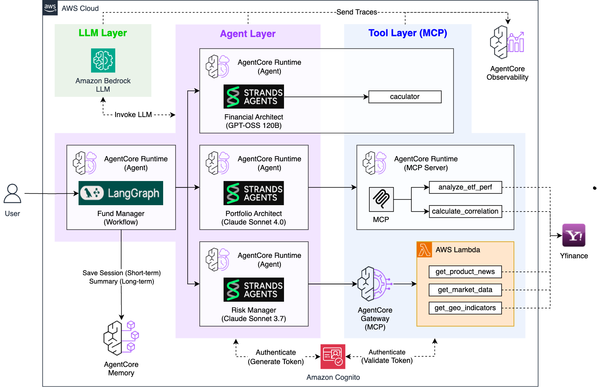
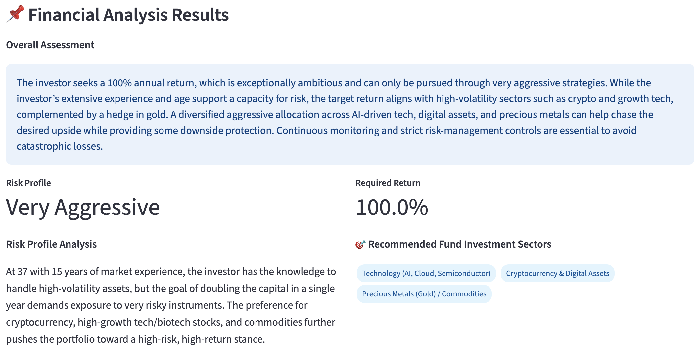

# 🤖 Agentic AI Fund Manager

Agentic AI Fund Manager powered by **AWS Bedrock AgentCore & Strands Agent & LangGraph**

## 🎯 System Overview

A production-level AI fund management system where 4 specialized AI agents collaborate to provide institutional-grade portfolio management and risk optimization.

## Live Demo & Expected Output

Watch how all 4 AI agents collaborate in real-time to provide comprehensive fund management analysis:

[](https://youtu.be/hb-zWkbXQdE)

🎥 **[▶️ Watch Full Demo Video](https://youtu.be/hb-zWkbXQdE)** 

## 🏗️ Overall System Architecture



## 🏗️ Detailed Agent Architecture

### Lab 1: Financial Analyst
**Role**: Personal financial situation analysis and risk profile assessment


**Architecture**:
- **AgentCore Runtime**: Serverless agent hosting
- **Tools**: Calculator (accurate return calculation)
- **AI Model**: OpenAI GPT-OSS 120B

**Processing Flow**:
1. Analyze user input data (age, investment experience, investment amount, target amount)
2. Calculate required annual return using Calculator tool: `((target_amount/investment_amount)-1)*100`
3. Assess risk profile considering age and experience (Conservative/Neutral/Aggressive)
4. Recommend investment sectors based on personal preferences

**Output**:



### Lab 2: Portfolio Architect
**Role**: Optimal fund portfolio design based on real-time ETF data


**Architecture**:
- **AgentCore Runtime**: Main portfolio design agent
- **MCP Server Runtime**: yfinance API integration (deployed as separate Runtime)
- **Tools**: `analyze_etf_performance`, `calculate_correlation`
- **Authentication**: Cognito JWT OAuth2 (direct Runtime-to-Runtime communication)

**Processing Flow**:
1. Select 5 candidate ETFs based on Financial Analyst results
2. Execute Monte Carlo simulation (1000 iterations) for each ETF
3. Calculate correlation matrix between ETFs (measure diversification effects)
4. Select optimal 3 ETFs considering returns and diversification effects
5. Determine investment weights and evaluate portfolio (profitability/risk management/diversification scores)

**Output**:


### Lab 3: Risk Manager
**Role**: Fund risk scenario analysis based on news and macroeconomic data


**Architecture**:
- **AgentCore Gateway**: Expose Lambda functions as MCP tools
- **Lambda Layer**: yfinance library packaging
- **Lambda Functions**: News/market/geopolitical data retrieval
- **Tools**: `get_product_news`, `get_market_data`, `get_geopolitical_indicators`

**Processing Flow**:
1. Collect and analyze latest 5 news articles for each portfolio ETF
2. Real-time retrieval of 7 major macroeconomic indicators (interest rates, dollar index, VIX, oil, gold, S&P500)
3. Query 5 regional ETFs (China, emerging markets, Europe, Japan, Korea)
4. Synthesize 3 data types to derive 2 key economic scenarios
5. Establish portfolio adjustment strategies for each scenario

**Output**:


### Lab 4: Fund Manager
**Role**: Integration of 3 agent results and long-term memory management


**Architecture**:
- **LangGraph**: Sequential execution workflow of 3 agents
- **AgentCore Memory**: Automatic consultation history summarization with SUMMARY strategy
- **Agent Invocation**: Direct calls to other 3 agent Runtimes

**Processing Flow**:
1. **Sequential Agent Execution**:
   - `financial_node` → Invoke Financial Analyst Runtime
   - `portfolio_node` → Invoke Portfolio Architect Runtime  
   - `risk_node` → Invoke Risk Manager Runtime
2. **Real-time Streaming**: Display each agent's reasoning process and tool usage in real-time
3. **Memory Storage**: Save each agent's results as session-based conversation events
4. **Automatic Summarization**: SUMMARY strategy structures and summarizes entire consultation sessions by topics

**Output**:


## 🔧 Technical Implementation Details

### AgentCore Service Utilization

**1. Runtime (Agent) - Agent Hosting**
- Deploy each AI agent as independent serverless functions
- Automatic scaling and high availability guaranteed
- ECR container image-based deployment

**2. Runtime (MCP Server) - Data Server Hosting**
- Deploy yfinance-based ETF data retrieval server as serverless
- AI tooling through MCP protocol
- Real-time financial data provision

**3. Gateway - Lambda Function to MCP Conversion**
- Convert Lambda functions to MCP tools usable by AI (used by Risk Manager)
- Enhanced security with Cognito JWT authentication
- Abstract complex Lambda infrastructure into simple AI tools

**4. Memory - Long-term Memory and Personalization**
- Automatic fund management session summarization with SUMMARY strategy
- Long-term preservation of user-specific fund management history
- Foundation for personalized fund management services

**5. Observability - Monitoring and Tracking**
- Monitor performance and usage of each agent
- Real-time log and metric collection
- Insights for system optimization

## 🚀 Quick Start

### 1. Prerequisites

#### AWS Bedrock Model Access Setup (Required)
This project requires access permissions for the following Bedrock models:

- **OpenAI GPT-OSS 120B** (`openai.gpt-oss-120b-1:0`) - For Financial Analyst
- **Claude 4.0 Sonnet** (`global.anthropic.claude-sonnet-4-20250514-v1:0`) - For Portfolio Architect  
- **Claude 3.7 Sonnet** (`us.anthropic.claude-3-7-sonnet-20250219-v1:0`) - For Risk Manager

**How to request model access:**
1. Navigate to **Amazon Bedrock** service in AWS Console
2. Click **Model access** in the left menu
3. Click **Request model access** for the above 3 models
4. Wait for approval completion (usually takes a few minutes)

#### Region Configuration
All resources are deployed to the **us-west-2** region. This can be changed in the `config.py` file.

### 2. Environment Setup
```bash
git clone <repository-url>
cd agentic_ai_fund_manager
python3 -m venv venv
source venv/bin/activate
pip install -r requirements.txt
aws configure  # us-west-2 region configuration recommended
```

### 3. Complete Deployment (Recommended)
```bash
python deploy_all.py
```

### 4. Run Web App
```bash
cd fund_manager && streamlit run app.py
```
Access `http://localhost:8501` in browser

### 5. Complete Cleanup
```bash
python cleanup_all.py
```

## 🎯 Usage Scenarios

### Scenario 1: Complete System Experience (Recommended)
1. `python deploy_all.py` - Deploy entire system
2. `cd fund_manager && streamlit run app.py` - Run integrated web app
3. Enter investment information and observe real-time collaboration between 4 agents
4. Check automatically summarized past fund management records in management history

### Scenario 2: Individual Agent Learning
1. `cd financial_analyst && python deploy.py && streamlit run app.py`
2. Observe financial analysis process and Calculator tool usage
3. `cd ../portfolio_architect` - Learn portfolio design process
4. `cd ../risk_manager` - Learn risk analysis process

### Scenario 3: Development and Customization
1. Refer to `README.md` in each agent folder to understand detailed structure
2. Verify functionality through individual deployment and testing (check deployment status with `deployment_info.json` file)
3. Individual redeployment after code modifications (run `deploy.py` in each folder)
4. Test entire workflow in integrated web app
5. Develop new agents using common utility functions in `shared/` folder

## ⚙️ Configuration Changes

### Region and Common Settings Changes
All deployment scripts get common settings from the `config.py` file in the root:

```python
# config.py
class Config:
    # AWS region setting (commonly used by all agents)
    REGION = "us-west-2"  # Change to desired region
    
    # Agent name settings
    FINANCIAL_ANALYST_NAME = "financial_analyst"
    PORTFOLIO_ARCHITECT_NAME = "portfolio_architect"
    # ... other settings
```

**Redeployment after configuration changes:**
```bash
# Complete redeployment
python cleanup_all.py  # Clean up existing resources
python deploy_all.py   # Redeploy with new settings

# Or individual redeployment
cd financial_analyst && python deploy.py
```

### Bedrock Model Changes
You can change model IDs in each agent's main file:

```python
# financial_analyst/financial_analyst.py
class Config:
    MODEL_ID = "openai.gpt-oss-120b-1:0"  # Can be changed to other models
```

## 🔧 Technology Stack and Architecture

### Core Technologies
- **AI Framework**: Strands Agents SDK + LangGraph
- **Infrastructure**: AWS Bedrock AgentCore (Runtime, Gateway, Memory, Observability)
- **LLM**: 
  - Financial Analyst: OpenAI GPT-OSS 120B
  - Portfolio Architect: Claude 4.0 Sonnet (global.anthropic.claude-sonnet-4-20250514-v1:0)
  - Risk Manager: Claude 3.7 Sonnet (us.anthropic.claude-3-7-sonnet-20250219-v1:0)
  - Fund Manager: LangGraph orchestration (No LLM, calls other agents)
- **Data Sources**: yfinance (Real-time ETF/news/market data)
- **Authentication**: Cognito JWT OAuth2
- **UI**: Streamlit (Real-time streaming support)

### Deployment Architecture Diagram

```mermaid
graph LR
    subgraph "AWS Cloud Resources"
        subgraph "AgentCore Services"
            RT1[📦 Financial Analyst Runtime]
            RT2[📦 Portfolio Architect Runtime]
            RT3[📦 Risk Manager Runtime]
            RT4[📦 Fund Manager Runtime]
            MCP[🔧 MCP Server Runtime]
            MEM[🧠 AgentCore Memory]
            GW[🌉 Gateway for Risk Manager]
        end
        
        subgraph "Supporting Services"
            LAM[⚡ Lambda Functions x3]
            LAY[📦 Lambda Layer]
            COG[🔐 Cognito User Pool x2]
            ECR[📦 ECR Repository x5]
        end
    end
    
    RT1 --> ECR
    RT2 --> COG
    RT3 --> GW
    RT4 --> MEM
    COG --> MCP
    GW --> COG
    GW --> LAM
    LAM --> LAY
    MCP --> ECR
    
    style RT1 fill:#e1f5fe
    style RT2 fill:#f3e5f5
    style RT3 fill:#e8f5e8
    style RT4 fill:#fff3e0
    style MEM fill:#fce4ec
```



**Total Deployed Resources**: 
- 🏗️ **AgentCore**: 5 Runtimes (4 Agents + 1 MCP Server) + 1 Gateway + 1 Memory
- ⚡ **Lambda**: 3 Functions + 1 Layer
- 🔐 **Authentication**: 2 Cognito User Pools
- 📦 **Containers**: 5 ECR Repositories

### Security and Authentication
- **Cognito JWT**: MCP Gateway access control
- **IAM Roles**: Principle of least privilege for each service
- **VPC**: Network isolation when needed (optional)
- **Encryption**: Data encryption in transit and at rest

## 📁 Project Structure and Individual Testing

```
agentic_ai_fund_manager/
├── 📂 financial_analyst/           # Lab 1: Financial Analysis (AgentCore Runtime)
│   ├── 📄 README.md               # Detailed description and usage
│   ├── 🚀 deploy.py               # Individual deployment
│   ├── 🌐 app.py                  # Streamlit individual testing
│   └── 🤖 financial_analyst.py    # Main agent
│
├── 📂 portfolio_architect/         # Lab 2: Portfolio Design (AgentCore Runtime + MCP Server)
│   ├── 📄 README.md               # Detailed description and usage
│   ├── 🚀 deploy.py               # Individual deployment
│   ├── 🌐 app.py                  # Streamlit individual testing
│   ├── 🤖 portfolio_architect.py  # Main agent
│   └── 📂 mcp_server/             # MCP Server (Separate Runtime)
│       ├── 🚀 deploy_mcp.py       # MCP Server deployment
│       └── 🔧 server.py           # ETF data query server
│
├── 📂 risk_manager/               # Lab 3: Risk Management (AgentCore Gateway)
│   ├── 📄 README.md               # Detailed description and usage
│   ├── 🚀 deploy.py               # Individual deployment (4-step integration)
│   ├── 🌐 app.py                  # Streamlit individual testing
│   ├── 🤖 risk_manager.py         # Main agent
│   ├── 📂 lambda_layer/           # Lambda Layer (yfinance)
│   ├── 📂 lambda/                 # Lambda function (data query)
│   └── 📂 gateway/                # MCP Gateway (Lambda → MCP tools)
│
├── 📂 fund_manager/         # Lab 4: Fund Management Orchestration (AgentCore Memory)
│   ├── 📄 README.md               # Detailed description and usage
│   ├── 🚀 deploy.py               # Individual deployment
│   ├── 🌐 app.py                  # Streamlit integrated web app (main)
│   ├── 🤖 fund_manager.py   # LangGraph-based integrated agent
│   
│   └── 📂 agentcore_memory/       # AgentCore Memory
│       └── 🚀 deploy_agentcore_memory.py # Memory deployment
│
├── 📂 shared/                     # Common utilities
│   ├── runtime_utils.py           # Runtime-related common functions
│   ├── gateway_utils.py           # Gateway-related common functions
│   └── cognito_utils.py           # Authentication-related common functions
│
├── 🚀 deploy_all.py               # 🎯 Deploy entire system at once
├── 🧹 cleanup_all.py              # 🎯 Clean up entire system at once
├── ⚙️ config.py                   # 🎯 Common project settings (region, names, etc.)
├── 📋 requirements.txt            # Python dependencies
└── 📄 README.md                   # This file
```

### 🧪 Individual Agent Testing Methods

Each agent can be deployed and tested independently:

#### Lab 1: Financial Analyst
```bash
cd financial_analyst
python deploy.py                    # Deploy
streamlit run app.py               # Individual test web app
```
- **Features**: Investor information input → Risk tolerance assessment → Target return calculation
- **Tools**: Verify accurate return calculation process with Calculator

#### Lab 2: Portfolio Architect  
```bash
cd portfolio_architect
cd mcp_server && python deploy_mcp.py && cd ..  # Deploy MCP Server first
python deploy.py                    # Deploy main agent
streamlit run app.py               # Individual test web app
```
- **Features**: Financial analysis results input → ETF analysis → Portfolio design
- **Architecture**: Direct MCP communication between Runtimes (no Gateway)
- **Tools**: Real-time verification of Monte Carlo simulation + correlation analysis process

#### Lab 3: Risk Manager
```bash
cd risk_manager
# 4-step sequential deployment (required)
cd lambda_layer && python deploy_lambda_layer.py && cd ..
cd lambda && python deploy_lambda.py && cd ..
cd gateway && python deploy_gateway.py && cd ..
python deploy.py                    # Deploy Risk Manager Runtime
streamlit run app.py               # Individual test web app
```
- **Features**: Portfolio input → News/market data analysis → Risk scenarios
- **Tools**: Verify real-time news, macroeconomic indicators, and geopolitical data collection process

#### Lab 4: Fund Manager (Integrated System)
```bash
cd fund_manager
cd agentcore_memory && python deploy_agentcore_memory.py && cd ..  # Deploy Memory first
python deploy.py                    # Deploy integrated agent
streamlit run app.py               # 🎯 Main integrated web app
```
- **Features**: Execute entire workflow → Sequential calls to 3 agents → Final fund management guide
- **Characteristics**: Real-time streaming to observe all agents' thinking processes + fund management history tracking
