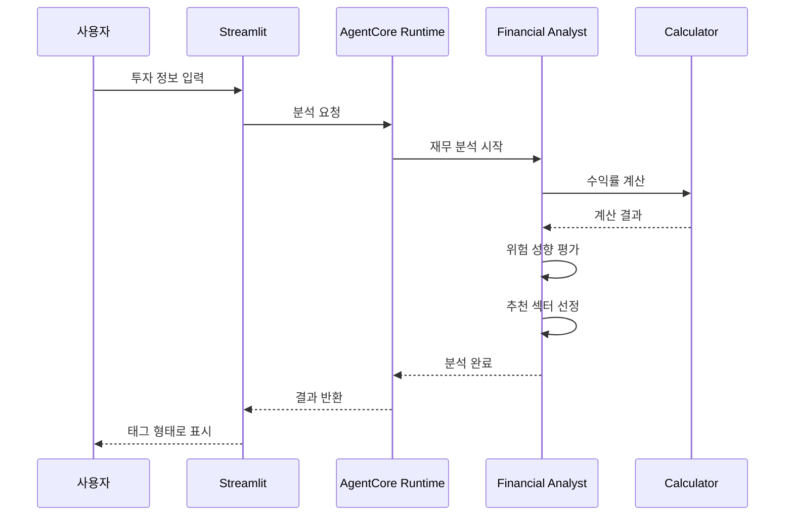

# Financial Analyst

**AWS Bedrock AgentCore Runtime**을 활용한 AI 재무 분석사입니다.

## 🎯 개요

개인의 재무 상황을 분석하여 위험 성향과 목표 수익률을 계산하는 AI 에이전트입니다.

### 핵심 기능
- **재무 분석**: 나이, 투자 경험, 목표 금액 기반 위험 성향 평가
- **수익률 계산**: Calculator 도구를 활용한 정확한 목표 수익률 산출
- **추천 섹터**: 개인 성향에 맞는 투자 분야 추천 (태그 형태로 표시)

## 🏗️ 아키텍처


### 기술 스택
- **AI Framework**: Strands Agents SDK
- **Infrastructure**: AWS Bedrock AgentCore Runtime (서버리스)
- **LLM**: OpenAI GPT-OSS 120B
- **Tools**: Calculator (수익률 계산)
- **UI**: Streamlit

## 🚀 설치 및 실행

### 1. 환경 설정
```bash
# 루트 폴더에서 의존성 설치
cd ..
pip install -r requirements.txt

# AWS 자격 증명 설정
aws configure

# financial_analyst 폴더로 이동
cd financial_analyst
```

### 2. 배포
```bash
# AgentCore Runtime 배포 (필수)
python deploy.py

# 배포 상태 확인 (deployment_info.json 자동 생성)
cat deployment_info.json
```

### 3. Streamlit 실습
```bash
# 웹 앱 실행
streamlit run app.py

# 브라우저에서 http://localhost:8501 접속
```

## 📊 사용 방법

### 입력 정보
- **투자 가능 금액**: 억원 단위 (예: 0.5 = 5천만원)
- **목표 금액**: 1년 후 목표 금액
- **나이**: 연령대 선택
- **투자 경험**: 주식 투자 경험 연수
- **투자 목적**: 단기 수익, 노후 준비 등
- **관심 분야**: 10개 투자 섹터 중 복수 선택

### 출력 결과
```json
{
  "risk_profile": "공격적",
  "risk_profile_reason": "35세, 10년 경험으로 높은 위험 감수 능력",
  "required_annual_return_rate": 40.0,
  "key_sectors": ["성장주", "암호화폐", "글로벌 주식"],
  "summary": "40% 목표 수익률 달성을 위한 공격적 투자 전략 필요"
}
```

### 처리 흐름


## 🔧 커스터마이징

### 모델 변경
```python
# financial_analyst.py
class Config:
    MODEL_ID = "openai.gpt-oss-120b-1:0"  # 원하는 모델로 변경
    TEMPERATURE = 0.1
    MAX_TOKENS = 3000
```

### 투자 분야 수정
```python
# app.py에서 options 리스트 수정
options=[
    "배당주 (안정적 배당)",
    "성장주 (기술/바이오)",
    # ... 추가/수정
]
```

## 📁 프로젝트 구조

```
financial_analyst/
├── financial_analyst.py    # 메인 에이전트 (AgentCore Runtime)
├── deploy.py               # AgentCore Runtime 배포
├── cleanup.py              # 시스템 정리
├── app.py                  # Streamlit 웹 앱
└── requirements.txt        # Python 의존성
```

## 🔗 전체 시스템 연동

이 Financial Analyst는 **AI 투자 어드바이저** 시스템의 첫 번째 단계입니다:

1. **Financial Analyst** (현재) → 재무 분석 및 위험 성향 평가
2. **Portfolio Architect** → 실시간 ETF 데이터 기반 포트폴리오 설계  
3. **Risk Manager** → 뉴스 분석 및 리스크 시나리오 플래닝
4. **Investment Advisor** → 전체 에이전트 통합 및 최종 리포트

전체 시스템 실행은 `../investment_advisor/app.py`에서 가능합니다.