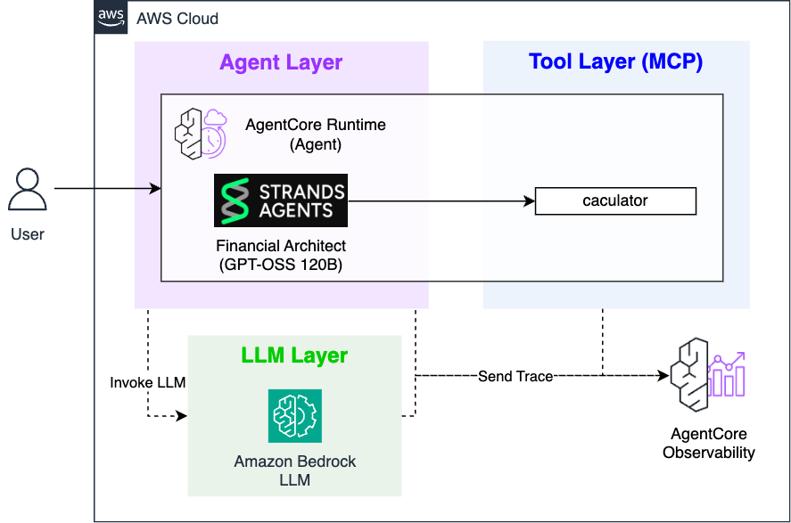
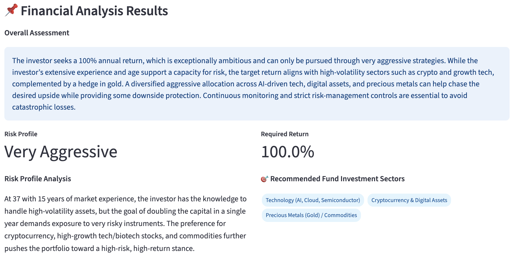
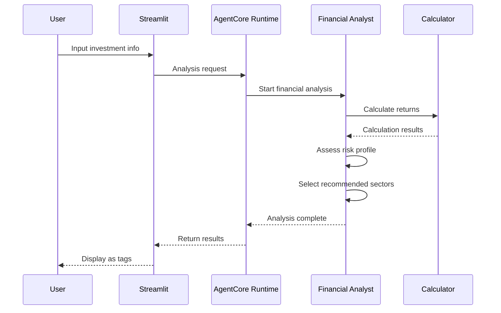

# Financial Analyst

AI Financial Analyst powered by **AWS Bedrock AgentCore Runtime**.

## 🎯 Overview

An AI agent that analyzes personal financial situations to calculate risk profiles and target returns.

### Core Features
- **Financial Analysis**: Risk profile assessment based on age, investment experience, and target amounts
- **Return Calculation**: Precise target return calculation using Calculator tool
- **Sector Recommendations**: Investment sector recommendations tailored to individual preferences (displayed as tags)

## 🏗️ Architecture





### Technology Stack
- **AI Framework**: Strands Agents SDK
- **Infrastructure**: AWS Bedrock AgentCore Runtime (serverless)
- **LLM**: OpenAI GPT-OSS 120B
- **Tools**: Calculator (return calculation)
- **UI**: Streamlit

## 🚀 Installation and Setup

### 1. Environment Setup
```bash
# Install dependencies from root folder
cd ..
pip install -r requirements.txt

# Configure AWS credentials
aws configure

# Navigate to financial_analyst folder
cd financial_analyst
```

### 2. Deployment
```bash
# Deploy AgentCore Runtime (required)
python deploy.py

# Check deployment status (deployment_info.json auto-generated)
cat deployment_info.json
```

### 3. Streamlit Demo
```bash
# Run web app
streamlit run app.py

# Access http://localhost:8501 in browser
```

## 📊 Usage

### Input Information
- **Available Investment Amount**: In hundred millions (e.g., 0.5 = 50 million)
- **Target Amount**: Target amount after 1 year
- **Age**: Age range selection
- **Investment Experience**: Years of stock investment experience
- **Investment Purpose**: Short-term profit, retirement planning, etc.
- **Areas of Interest**: Multiple selection from 10 investment sectors

### Output Results



### Processing Flow


## 🔧 Customization

### Model Configuration
```python
# financial_analyst.py
class Config:
    MODEL_ID = "openai.gpt-oss-120b-1:0"  # Change to desired model
    TEMPERATURE = 0.1
    MAX_TOKENS = 3000
```

### Investment Sectors Modification
```python
# Modify options list in app.py
options=[
    "Dividend Stocks (Stable Dividends)",
    "Growth Stocks (Tech/Bio)",
    # ... add/modify
]
```

## 📁 Project Structure

```
financial_analyst/
├── financial_analyst.py    # Main agent (AgentCore Runtime)
├── deploy.py               # AgentCore Runtime deployment
├── cleanup.py              # System cleanup
├── app.py                  # Streamlit web app
└── requirements.txt        # Python dependencies
```

## 🔗 Full System Integration

This Financial Analyst is the first stage of the **AI Fund Manager** system:

1. **Financial Analyst** (current) → Financial analysis and risk profile assessment
2. **Portfolio Architect** → Real-time ETF data-based portfolio design  
3. **Risk Manager** → News analysis and risk scenario planning
4. **Fund Manager** → Full agent integration and final report

The complete system can be run from `../fund_manager/app.py`.