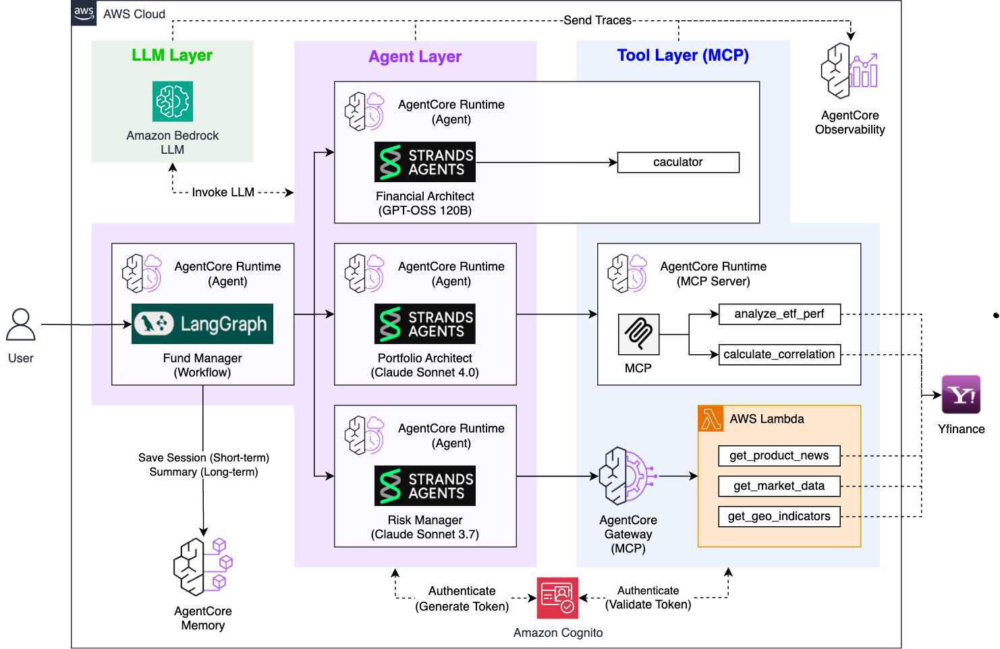
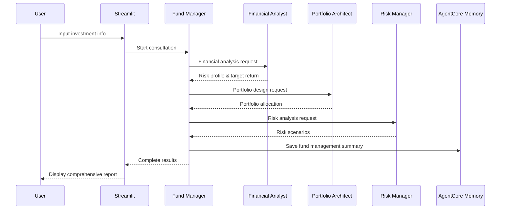
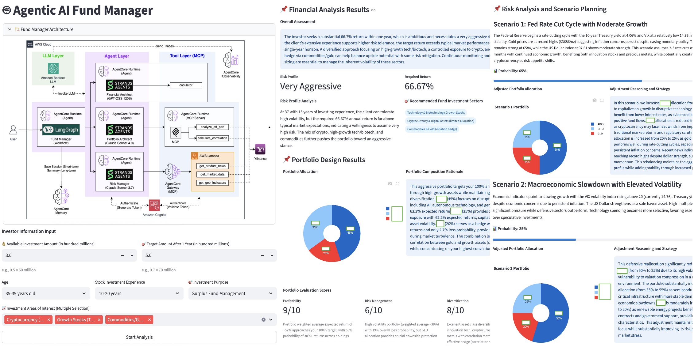

# Fund Manager

LangGraph-based Multi-Agent Fund Management System powered by **AWS Bedrock AgentCore Runtime** and **AgentCore Memory**.

## 🎯 Overview

An AI orchestrator that integrates 3 specialized agents through LangGraph workflows to provide comprehensive fund management services with automatic management history tracking.

### Core Features

- **LangGraph Workflow**: Sequential collaboration system of 3 agents
- **Real-time Streaming**: Real-time visualization of each agent's reasoning process and tool usage
- **AgentCore Memory**: Automatic fund management history summarization and permanent storage with SUMMARY strategy
- **Full Automation**: Complete fund management process with user input only

## 🏗️ Architecture



### Technology Stack
- **AI Framework**: LangGraph + Strands Agents SDK
- **Infrastructure**: AWS Bedrock AgentCore Runtime + Memory
- **LLM**: Orchestrates other agents (no direct model usage)
- **Data Sources**: Via integrated agents (yfinance through MCP)
- **Protocol**: Agent-to-agent communication
- **UI**: Streamlit

### Processing Flow


## 🚀 Installation and Setup

### 1. Environment Setup
```bash
# Install dependencies from root folder
cd ..
pip install -r requirements.txt

# Configure AWS credentials
aws configure

# Navigate to fund_manager folder
cd fund_manager
```

### 2. Prerequisites
All individual agents must be deployed first:

```bash
# 1. Financial Analyst
cd financial_analyst && python deploy.py

# 2. Portfolio Architect (including MCP Server)
cd ../portfolio_architect/mcp_server && python deploy_mcp.py
cd .. && python deploy.py

# 3. Risk Manager (4-step sequential deployment)
cd ../risk_manager/lambda_layer && python deploy_lambda_layer.py
cd ../lambda && python deploy_lambda.py
cd ../gateway && python deploy_gateway.py
cd .. && python deploy.py
```

### 3. Deployment
```bash
# Deploy Memory first
cd fund_manager/agentcore_memory
python deploy_agentcore_memory.py

# Deploy Fund Manager Runtime
cd .. && python deploy.py

# Run Streamlit app
streamlit run app.py

# Access http://localhost:8501 in browser
```

## 📊 Usage

### New Fund Management
1. Input client information (age, fund investment experience, fund amount, target amount, etc.)
2. Execute LangGraph workflow (3 agents in sequential execution)
3. Real-time monitoring (check each agent's reasoning process and tool usage)
4. Review comprehensive results (Financial Analysis → Portfolio Design → Risk Scenarios)

### Management History
- Review fund management summaries automatically generated by AgentCore SUMMARY strategy
- Clean display of summary content organized by topics

## 📋 Input/Output

### Input Information
- **Available Fund Amount**: In hundred millions (e.g., 0.5 = 50 million)
- **Target Amount**: Target amount after 1 year
- **Age**: Age range selection
- **Fund Investment Experience**: Years of stock fund investment experience
- **Fund Management Purpose**: Short-term profit, retirement planning, etc.
- **Areas of Interest**: Multiple selection from 10 fund investment sectors

### Output Results



## 🧠 AgentCore Memory System

### SUMMARY Strategy
- **Automatic Summarization**: Entire consultation sessions automatically summarized
- **Short-term Storage**: Individual agent results stored as conversations (7 days)
- **Long-term Preservation**: SUMMARY strategy creates permanent consultation summaries
- **Namespace Structure**: `fund/session/{sessionId}` for organized storage


## 🔧 Customization

### Configuration Changes
```python
# fund_manager.py
class Config:
    REGION = "us-west-2"  # Change AWS region
```

### Agent Configuration
```python
# fund_manager.py
class AgentClient:
    def _load_agent_arns(self):
        # Automatically loads other agent ARNs
        return {
            "financial": "arn:aws:bedrock-agentcore:...",
            "portfolio": "arn:aws:bedrock-agentcore:...",
            "risk": "arn:aws:bedrock-agentcore:..."
        }
```

## 🔍 Monitoring

### Log Checking
```bash
aws logs tail /aws/bedrock-agentcore/fund-manager --follow
```

### Performance Metrics
- Total execution time: 60-120 seconds (sequential calls)
- Memory save time: 2-5 seconds
- Success rate: 95%+ (when all agents are properly deployed)

### Troubleshooting
1. Agent call failure → Check individual agent deployment status
2. Memory save failure → Check IAM permissions and Memory configuration

## 📁 Project Structure

```
fund_manager/
├── fund_manager.py    # LangGraph-based Multi-Agent workflow
├── deploy.py               # AgentCore Runtime deployment (auto-load other agent ARNs)
├── app.py                  # Streamlit web app (real-time streaming + history)

├── cleanup.py              # System cleanup
├── requirements.txt        # Python dependencies
└── agentcore_memory/       # AgentCore Memory
    ├── deploy_agentcore_memory.py # Memory deployment (SUMMARY strategy)
    └── deployment_info.json      # Memory deployment info
```

## 🔗 Full System Integration

This Fund Manager is the final orchestration stage of the **AI Fund Manager** system:

1. **Financial Analyst** → Financial analysis and risk profile assessment
2. **Portfolio Architect** → Real-time ETF data-based portfolio design
3. **Risk Manager** → News analysis and risk scenario planning
4. **Fund Manager** (current) → Multi-agent orchestration and consultation history management

The complete system provides end-to-end fund management services through seamless agent collaboration.