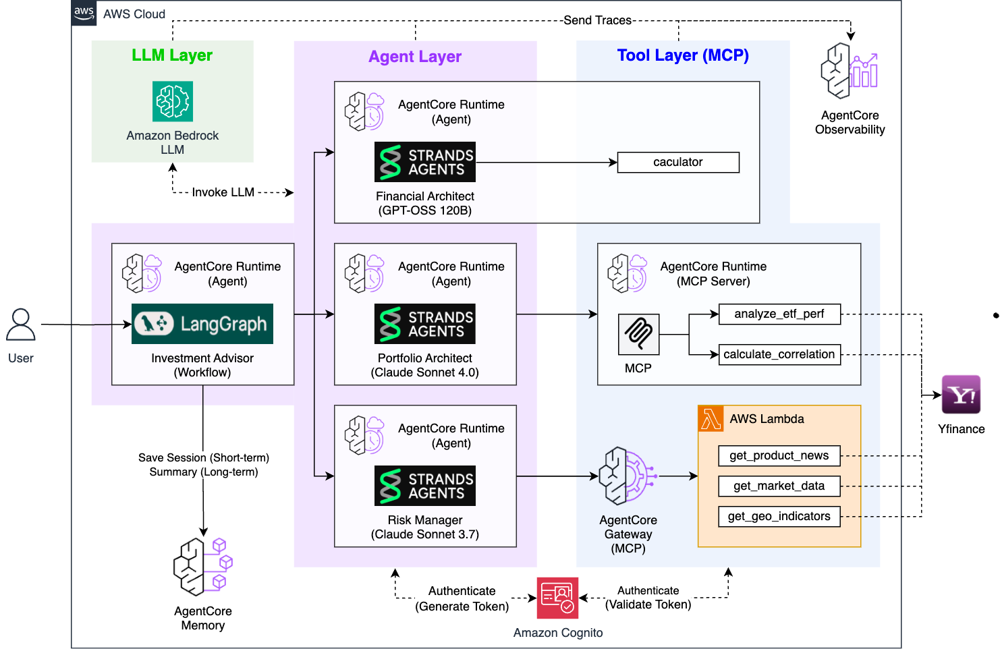

# Investment Advisor

**LangGraph + AgentCore Memory 기반 Multi-Agent 투자 자문 시스템**

3개의 전문 AI 에이전트가 LangGraph 워크플로우로 협업하여 종합적인 투자 분석을 제공하고, AgentCore Memory를 통해 상담 히스토리를 자동으로 관리하는 엔터프라이즈급 투자 자문 시스템입니다.

## 🎯 핵심 기능

- **LangGraph 워크플로우**: 3개 에이전트의 순차적 협업 시스템
- **실시간 스트리밍**: 각 에이전트의 사고 과정과 도구 사용을 실시간 시각화
- **AgentCore Memory**: SUMMARY 전략으로 상담 히스토리 자동 요약 및 영구 보존
- **완전 자동화**: 사용자 입력만으로 전체 투자 자문 프로세스 완료

## 🏗️ 아키텍처



### LangGraph 워크플로우 구조
```python
# investment_advisor.py의 핵심 구조
workflow = StateGraph(InvestmentState)

# 3개 노드 정의
workflow.add_node("financial", financial_node)      # 재무 분석
workflow.add_node("portfolio", portfolio_node)      # 포트폴리오 설계
workflow.add_node("risk", risk_node)               # 리스크 분석

# 순차 실행 흐름
workflow.set_entry_point("financial")
workflow.add_edge("financial", "portfolio")
workflow.add_edge("portfolio", "risk")
workflow.add_edge("risk", END)
```

### 기술 스택
- **AI Framework**: LangGraph + Strands Agents SDK
- **Infrastructure**: AWS Bedrock AgentCore Runtime + Memory
- **LLM**: 다른 에이전트 호출 (자체 모델 없음)
- **Data Sources**: yfinance (실시간 ETF/뉴스/시장 데이터)
- **UI**: Streamlit

### 에이전트 워크플로우

1. **Financial Analyst** → 재무 분석 및 위험 성향 평가 (Calculator 도구)
2. **Portfolio Architect** → 실시간 ETF 데이터 기반 포트폴리오 설계 (MCP Server)
3. **Risk Manager** → 뉴스 기반 리스크 분석 및 시나리오 플래닝 (MCP Gateway)

## 🚀 배포 및 실행

### 1. 사전 요구사항
모든 개별 에이전트가 먼저 배포되어 있어야 합니다:

```bash
# 1. Financial Analyst
cd financial_analyst && python deploy.py

# 2. Portfolio Architect (MCP Server 포함)
cd ../portfolio_architect/mcp_server && python deploy_mcp.py
cd .. && python deploy.py

# 3. Risk Manager (4단계 순차 배포)
cd ../risk_manager/lambda_layer && python deploy_lambda_layer.py
cd ../lambda && python deploy_lambda.py
cd ../gateway && python deploy_gateway.py
cd .. && python deploy.py
```

### 2. Investment Advisor 배포
```bash
# Memory 먼저 배포
cd investment_advisor/agentcore_memory
python deploy_agentcore_memory.py

# Investment Advisor Runtime 배포
cd .. && python deploy.py

# Streamlit 앱 실행
streamlit run app.py
```

## 📊 사용 방법

### 새로운 투자 상담
1. 투자자 정보 입력 (나이, 투자 경험, 투자 금액, 목표 금액 등)
2. LangGraph 워크플로우 실행 (3개 에이전트 순차 실행)
3. 실시간 모니터링 (각 에이전트의 사고 과정과 도구 사용 확인)
4. 종합 결과 확인 (재무 분석 → 포트폴리오 설계 → 리스크 시나리오)

### 상담 히스토리
- AgentCore SUMMARY 전략이 자동으로 생성한 투자 상담 요약 확인
- Topic별로 구분된 요약 내용을 깔끔하게 표시

## 📋 입력/출력

### 입력 정보
- 투자 가능 금액, 목표 금액 (억원 단위)
- 나이, 투자 경험 연수
- 투자 목적, 관심 투자 분야

### 처리 흐름
1. **Financial Analyst**: Calculator로 수익률 계산 → 위험 성향 평가
2. **Portfolio Architect**: MCP Server로 ETF 분석 → 포트폴리오 배분
3. **Risk Manager**: MCP Gateway로 뉴스/시장 데이터 분석 → 리스크 시나리오
4. **Memory**: SUMMARY 전략으로 상담 세션 자동 요약

## 🧠 AgentCore Memory 시스템

### SUMMARY 전략
- 전체 투자 상담 세션을 자동 요약
- Short-term: 각 에이전트 결과를 세션별 대화로 저장 (7일)
- Long-term: SUMMARY 전략이 전체 세션을 자동 요약하여 영구 보존
- 네임스페이스: `investment/session/{sessionId}` 구조


## 🔧 커스터마이징

### 설정 변경
```python
# investment_advisor.py
class Config:
    REGION = "us-west-2"  # AWS 리전 변경
```

### Memory 조회
```python
# Short-term: 세션별 상세 결과
memory_client.get_events(memory_id=memory_id, session_id=session_id)

# Long-term: SUMMARY 조회
memory_client.search(memory_id=memory_id, query="investment analysis summary")
```

## 🔍 모니터링

### 로그 확인
```bash
aws logs tail /aws/lambda/investment-advisor-runtime --follow
```

### 성능 메트릭
- 전체 실행 시간: 60-120초 (순차 호출)
- Memory 저장 시간: 2-5초
- 성공률: 95%+ (모든 에이전트 정상 배포 시)

### 문제 해결
1. 에이전트 호출 실패 → 개별 에이전트 배포 상태 확인
2. Memory 저장 실패 → IAM 권한 및 Memory 설정 확인

## 📁 프로젝트 구조

```
investment_advisor/
├── investment_advisor.py    # LangGraph 기반 Multi-Agent 워크플로우
├── deploy.py               # AgentCore Runtime 배포 (다른 에이전트 ARN 자동 로드)
├── app.py                  # Streamlit 웹 앱 (실시간 스트리밍 + 히스토리)

├── cleanup.py              # 시스템 정리
├── requirements.txt        # Python 의존성
└── agentcore_memory/       # AgentCore Memory
    ├── deploy_agentcore_memory.py # Memory 배포 (SUMMARY 전략)
    └── deployment_info.json      # Memory 배포 정보
```

## 🔗 전체 시스템 연동

이 Investment Advisor는 **AI 투자 어드바이저** 시스템의 최종 통합 단계입니다:

1. **Financial Analyst** → Calculator 도구로 정확한 재무 분석
2. **Portfolio Architect** → MCP Server로 실시간 ETF 데이터 기반 포트폴리오 설계
3. **Risk Manager** → MCP Gateway로 뉴스/시장/지정학적 리스크 분석
4. **Investment Advisor** (현재) → LangGraph로 3개 에이전트 통합 + Memory 자동 요약

## 🎉 주요 장점

- **LangGraph 워크플로우**: 명확한 상태 관리와 에이전트 간 데이터 흐름
- **실시간 스트리밍**: 각 에이전트의 사고 과정과 도구 사용을 실시간 시각화
- **완전 자동화**: 사용자 입력만으로 3단계 전문 분석 완료
- **지능형 메모리**: SUMMARY 전략으로 상담 히스토리 자동 요약 및 영구 보존
- **엔터프라이즈급**: 각 에이전트가 독립 배포되어 확장성과 유지보수성 확보

Investment Advisor는 **LangGraph + AgentCore Memory**를 활용한 차세대 Multi-Agent 투자 자문 시스템으로, 3개 전문 에이전트의 협업을 통해 은행급 투자 서비스를 제공합니다! 🚀