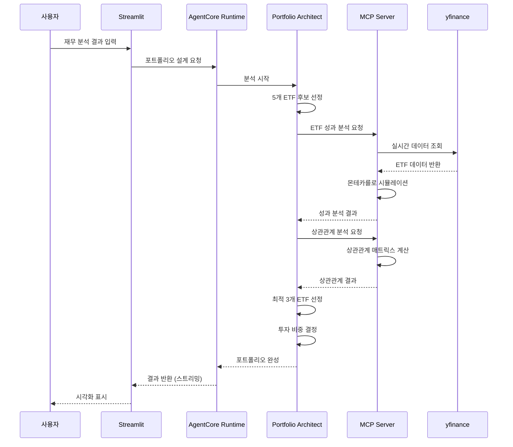

# Portfolio Architect

**AWS Bedrock AgentCore Runtime**과 **MCP Server**를 활용한 AI 포트폴리오 설계사입니다.

## 🎯 개요

Financial Analyst의 재무 분석 결과를 바탕으로 실시간 ETF 데이터를 활용하여 최적의 투자 포트폴리오를 설계하는 AI 에이전트입니다.

### 핵심 기능
- **실시간 ETF 분석**: MCP Server를 통한 yfinance 기반 실시간 데이터 조회
- **몬테카를로 시뮬레이션**: 1000회 시뮬레이션으로 정확한 위험도 분석
- **상관관계 분석**: ETF 간 분산투자 효과 측정 및 최적화
- **포트폴리오 평가**: 수익성, 리스크 관리, 분산투자 완성도 3가지 지표로 1-10점 평가

## 🏗️ 아키텍처


### 기술 스택
- **AI Framework**: Strands Agents SDK
- **Infrastructure**: AWS Bedrock AgentCore Runtime (서버리스)
  - Portfolio Architect Agent Runtime
  - MCP Server Runtime (ETF 데이터 조회)
- **LLM**: Claude 4.0 Sonnet (global cross region)
- **Data Source**: yfinance (실시간 ETF 데이터)
- **Protocol**: MCP (Model Context Protocol)
- **Authentication**: Cognito JWT
- **UI**: Streamlit

## 🚀 설치 및 실행

### 1. 환경 설정
```bash
# 루트 폴더에서 의존성 설치
cd ..
pip install -r requirements.txt

# AWS 자격 증명 설정
aws configure

# portfolio_architect 폴더로 이동
cd portfolio_architect
```

### 2. 배포
```bash
# MCP Server 먼저 배포 (필수)
cd mcp_server
python deploy_mcp.py

# Portfolio Architect Runtime 배포
cd ..
python deploy.py

# 배포 상태 확인
cat deployment_info.json
```

### 3. Streamlit 실습
```bash
# 웹 앱 실행
streamlit run app.py

# 브라우저에서 http://localhost:8501 접속
```

## 📊 사용 방법

### 입력 정보 (Financial Analyst 결과)
- **위험 성향**: 보수적, 중립적, 공격적
- **위험 성향 근거**: 나이, 투자 경험 등
- **필요 연간 수익률**: 목표 수익률 (%)
- **추천 투자 분야**: 10개 섹터 중 복수 선택
- **종합 총평**: 투자 전략 요약

### 출력 결과
```json
{
  "portfolio_allocation": {"QQQ": 50, "SPY": 30, "BND": 20},
  "reason": "기술주 중심 성장 전략. (QQQ: 나스닥 100 기술주 ETF), (SPY: S&P 500 대형주 ETF), (BND: 미국 채권 ETF)",
  "portfolio_scores": {
    "profitability": {"score": 8, "reason": "목표 수익률 달성 가능성 높음"},
    "risk_management": {"score": 7, "reason": "적정 변동성 수준"},
    "diversification": {"score": 9, "reason": "낮은 상관관계로 우수한 분산투자"}
  }
}
```

### 처리 흐름


## 🔧 포트폴리오 설계 프로세스

### 1. 후보 ETF 선정
- key_sectors와 위험 성향 고려하여 5개 후보 선정

### 2. 성과 분석
- 각 ETF의 몬테카를로 시뮬레이션 (1000회)
- 예상 수익률, 손실 확률, 변동성 계산

### 3. 상관관계 분석
- 5x5 상관관계 매트릭스 생성
- 분산투자 효과 측정

### 4. 최적 3개 ETF 선정
- **수익률과 분산투자 효과 균형 고려**
- 목표 수익률 달성 가능성과 리스크 분산 동시 만족

### 5. 투자 비중 결정
- 성과 분석과 상관관계 결과 종합
- 정수 비율로 100% 배분

### 6. 포트폴리오 평가
- 수익성, 리스크 관리, 분산투자 완성도 각각 1-10점 평가

## 🛠️ MCP Server 도구

### analyze_etf_performance(ticker)
- **기능**: 개별 ETF 성과 분석 (몬테카를로 시뮬레이션 1000회)
- **분석 내용**: 
  - 예상 연간 수익률 계산
  - 손실 확률 (원금 손실 가능성)
  - 과거 연간 수익률 및 변동성
  - 수익률 구간별 분포 (7개 구간: -20% 이하 ~ 30% 이상)
- **데이터 기간**: 2년치 일일 수익률 데이터 기반

### calculate_correlation(tickers)
- **기능**: ETF 간 상관관계 매트릭스 계산
- **분석 내용**:
  - 5x5 상관관계 매트릭스 생성
  - 각 ETF 쌍별 상관계수 계산 (-1 ~ 1)
  - 분산투자 효과 측정 (낮은 상관관계일수록 분산투자 효과 높음)
- **데이터 기간**: 2년치 일일 수익률 데이터 기반 (최소 100일 이상 공통 데이터 필요)

## 🔧 커스터마이징

### 모델 변경
```python
# portfolio_architect.py
class Config:
    MODEL_ID = "global.anthropic.claude-sonnet-4-20250514-v1:0"  # Claude 4.0 Sonnet (global cross region)
    TEMPERATURE = 0.3
    MAX_TOKENS = 3000
```

### 투자 분야 수정
```python
# app.py에서 options 리스트 수정
options=[
    "기술주 (Technology)",
    "헬스케어 (Healthcare)",
    # ... 추가/수정
]
```

## 📁 프로젝트 구조

```
portfolio_architect/
├── portfolio_architect.py      # 메인 에이전트 (AgentCore Runtime)
├── deploy.py                   # AgentCore Runtime 배포
├── cleanup.py                  # 시스템 정리
├── app.py                      # Streamlit 웹 앱
├── requirements.txt            # Python 의존성
└── mcp_server/                 # MCP Server (AgentCore Runtime)
    ├── server.py               # ETF 데이터 MCP 서버
    ├── deploy_mcp.py           # MCP Server 배포
    └── requirements.txt        # MCP Server 의존성
```

## 🔗 전체 시스템 연동

이 Portfolio Architect는 **AI 투자 어드바이저** 시스템의 두 번째 단계입니다:

1. **Financial Analyst** → 재무 분석 및 위험 성향 평가
2. **Portfolio Architect** (현재) → 실시간 ETF 데이터 기반 포트폴리오 설계
3. **Risk Manager** → 뉴스 분석 및 리스크 시나리오 플래닝
4. **Investment Advisor** → 전체 에이전트 통합 및 최종 리포트

전체 시스템 실행은 `../investment_advisor/app.py`에서 가능합니다.