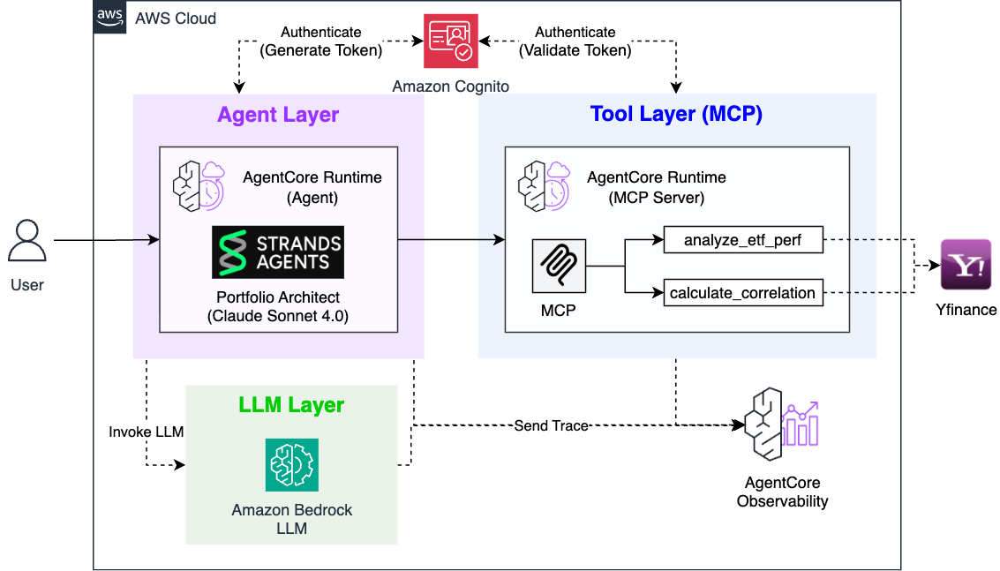
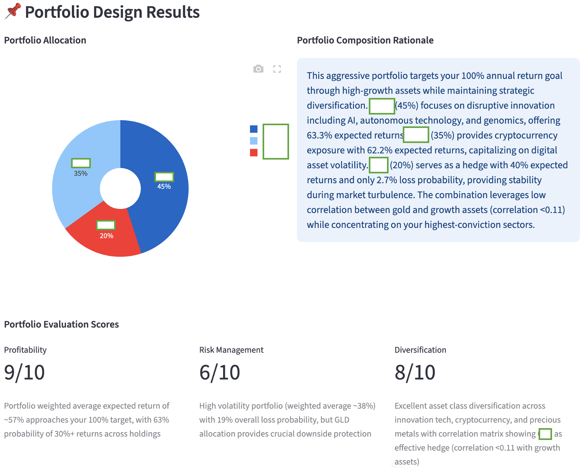
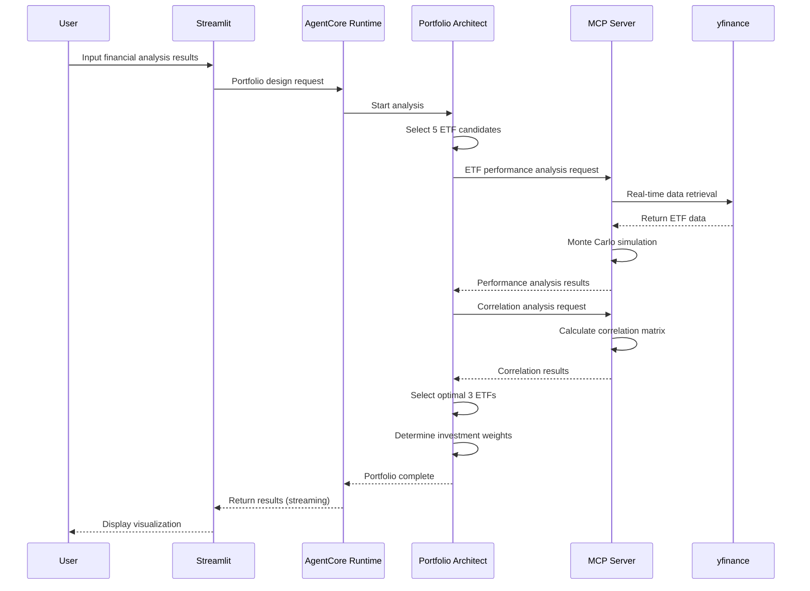

# Portfolio Architect

AI Portfolio Architect powered by **AWS Bedrock AgentCore Runtime** and **MCP Server**.

## 🎯 Overview

An AI agent that designs optimal investment portfolios using real-time ETF data based on Financial Analyst's financial analysis results.

### Core Features
- **Real-time ETF Analysis**: Real-time data retrieval based on yfinance through MCP Server
- **Monte Carlo Simulation**: Accurate risk analysis with 1000 simulations
- **Correlation Analysis**: Measurement and optimization of diversification effects between ETFs
- **Portfolio Evaluation**: 1-10 point evaluation across 3 indicators: profitability, risk management, and diversification

## 🏗️ Architecture



### Technology Stack
- **AI Framework**: Strands Agents SDK
- **Infrastructure**: AWS Bedrock AgentCore Runtime (serverless)
  - Portfolio Architect Agent Runtime
  - MCP Server Runtime (ETF data retrieval)
- **LLM**: Claude 4.0 Sonnet (global cross region)
- **Data Source**: yfinance (real-time ETF data)
- **Protocol**: MCP (Model Context Protocol)
- **Authentication**: Cognito JWT
- **UI**: Streamlit

## 🚀 Installation and Setup

### 1. Environment Setup
```bash
# Install dependencies from root folder
cd ..
pip install -r requirements.txt

# Configure AWS credentials
aws configure

# Navigate to portfolio_architect folder
cd portfolio_architect
```

### 2. Deployment
```bash
# Deploy MCP Server first (required)
cd mcp_server
python deploy_mcp.py

# Deploy Portfolio Architect Runtime
cd ..
python deploy.py

# Check deployment status
cat deployment_info.json
```

### 3. Streamlit Demo
```bash
# Run web app
streamlit run app.py

# Access http://localhost:8501 in browser
```

## 📊 Usage

### Input Information (Financial Analyst Results)
- **Risk Profile**: Conservative, Neutral, Aggressive
- **Risk Profile Reasoning**: Age, investment experience, etc.
- **Required Annual Return**: Target return rate (%)
- **Recommended Investment Areas**: Multiple selection from 10 sectors
- **Overall Assessment**: Investment strategy summary

### Output Results



### Processing Flow


## 🔧 Portfolio Design Process

### 1. Candidate ETF Selection
- Select 5 candidates considering key_sectors and risk profile

### 2. Performance Analysis
- Monte Carlo simulation for each ETF (1000 iterations)
- Calculate expected returns, loss probability, volatility

### 3. Correlation Analysis
- Generate 5x5 correlation matrix
- Measure diversification effects

### 4. Optimal 3 ETF Selection
- **Balance returns and diversification effects**
- Balance target return achievement and risk diversification

### 5. Investment Weight Determination
- Synthesize performance analysis and correlation results
- Allocate 100% in integer ratios

### 6. Portfolio Evaluation
- Evaluate profitability, risk management, and diversification on 1-10 scale each

## 🛠️ MCP Server Tools

### analyze_etf_performance(ticker)
- **Function**: Individual ETF performance analysis (1000 Monte Carlo simulations)
- **Analysis Content**: 
  - Expected annual return calculation
  - Loss probability (principal loss possibility)
  - Historical annual return and volatility
  - Return distribution by range (7 ranges: -20% and below ~ 30% and above)
- **Data Period**: Based on 2 years of daily return data

### calculate_correlation(tickers)
- **Function**: Calculate correlation matrix between ETFs
- **Analysis Content**:
  - Generate 5x5 correlation matrix
  - Calculate correlation coefficient for each ETF pair (-1 ~ 1)
  - Measure diversification effects (lower correlation = higher diversification effect)
- **Data Period**: Based on 2 years of daily return data (minimum 100+ days of common data required)

## 🔧 Customization

### Model Configuration
```python
# portfolio_architect.py
class Config:
    MODEL_ID = "global.anthropic.claude-sonnet-4-20250514-v1:0"  # Claude 4.0 Sonnet (global cross region)
    TEMPERATURE = 0.3
    MAX_TOKENS = 3000
```

### Investment Sectors Modification
```python
# Modify options list in app.py
options=[
    "Technology Stocks",
    "Healthcare",
    # ... add/modify
]
```

## 📁 Project Structure

```
portfolio_architect/
├── portfolio_architect.py      # Main agent (AgentCore Runtime)
├── deploy.py                   # AgentCore Runtime deployment
├── cleanup.py                  # System cleanup
├── app.py                      # Streamlit web app
├── requirements.txt            # Python dependencies
└── mcp_server/                 # MCP Server (AgentCore Runtime)
    ├── server.py               # ETF data MCP server
    ├── deploy_mcp.py           # MCP Server deployment
    └── requirements.txt        # MCP Server dependencies
```

## 🔗 Full System Integration

This Portfolio Architect is the second stage of the **AI Fund Manager** system:

1. **Financial Analyst** → Financial analysis and risk profile assessment
2. **Portfolio Architect** (current) → Real-time ETF data-based portfolio design
3. **Risk Manager** → News analysis and risk scenario planning
4. **Fund Manager** → Full agent integration and final report

The complete system can be run from `../fund_manager/app.py`.