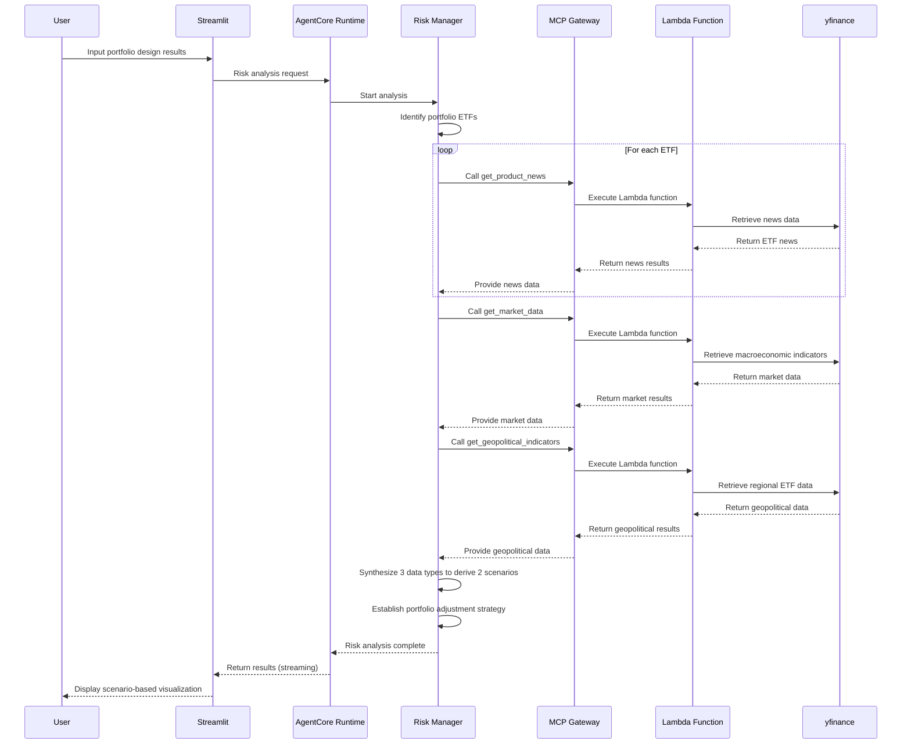

# Risk Manager

AI Risk Manager powered by **AWS Bedrock AgentCore Gateway**.

## 🎯 Overview

An AI agent that analyzes real-time news and macroeconomic data based on Portfolio Architect's portfolio design results to plan risk scenarios and provide portfolio adjustment strategies according to economic conditions.

### Core Features
- **Real-time News Analysis**: Collect latest news for portfolio ETFs and identify risk factors
- **Macroeconomic Indicator Monitoring**: Track major indicators including Dollar Index, Treasury yields, VIX, and oil prices
- **Scenario Planning**: Derive 2 key economic scenarios and establish portfolio adjustment strategies
- **Planning Pattern**: Systematic workflow-based risk analysis and response planning

## 🏗️ 아키텍처


### Technology Stack
- **AI Framework**: Strands Agents SDK
- **Infrastructure**: AWS Bedrock AgentCore Runtime + Gateway
  - Risk Manager Agent Runtime
  - MCP Gateway (expose Lambda functions as AI tools)
  - Lambda Layer (yfinance library packaging)
  - Lambda Functions (news and macroeconomic data retrieval)
- **LLM**: Claude 3.7 Sonnet (cross region)
- **Data Source**: yfinance (real-time news and market data)
- **Protocol**: MCP (Model Context Protocol)
- **Authentication**: Cognito JWT OAuth2
- **UI**: Streamlit

### Processing Flow


## 🔧 리스크 분석 프로세스

### 1. 포트폴리오 분석
- 입력받은 포트폴리오 구성 (3개 ETF + 비중) 분석
- 각 ETF의 특성 및 리스크 요인 식별

### 2. 실시간 뉴스 수집
- **get_product_news 도구**: 각 ETF별 최신 뉴스 5개 수집
- 제목, 요약, 발행일 정보 추출
- 리스크 요인 및 시장 심리 분석

### 3. 거시경제 지표 모니터링
- **get_market_data 도구**: 주요 경제 지표 7개 실시간 조회
  - 금리: 2년/10년 국채 수익률, 달러 지수
  - 변동성/원자재: VIX, WTI 원유, 금 선물
  - 주식: S&P 500 지수

### 4. 지정학적 리스크 분석
- **get_geopolitical_indicators 도구**: 주요 지역 ETF 5개 실시간 조회
  - 아시아: 중국 A주, 일본, 한국 ETF
  - 글로벌: 신흥국, 유럽 ETF

### 5. 시나리오 도출
- **2개 핵심 시나리오**: 뉴스 + 거시경제 + 지정학적 요인 종합 분석
- 각 시나리오별 발생 확률 및 영향도 평가

### 6. 포트폴리오 조정 전략
- **기존 ETF 유지**: 새로운 자산 추가 없이 비중만 조정
- 시나리오별 최적 배분 비율 계산
- 구체적인 조정 이유 및 실행 방안 제시

## 🚀 설치 및 실행

### 1. 환경 설정
```bash
# 루트 폴더에서 의존성 설치
cd ..
pip install -r requirements.txt

# AWS 자격 증명 설정
aws configure

# risk_manager 폴더로 이동
cd risk_manager
```

### 2. 배포 (4단계 순차 배포 필수)
```bash
# 1단계: Lambda Layer 배포 (yfinance 라이브러리)
cd lambda_layer
python deploy_lambda_layer.py

# 2단계: Lambda 함수 배포 (뉴스/시장 데이터 조회)
cd ../lambda
python deploy_lambda.py

# 3단계: MCP Gateway 배포 (Lambda를 AI 도구로 노출)
cd ../gateway
python deploy_gateway.py

# 4단계: Risk Manager Runtime 배포
cd ..
python deploy.py

# 배포 상태 확인
cat deployment_info.json
```

**⚠️ 주의**: 각 단계는 순서대로 실행해야 하며, 이전 단계가 완료된 후 다음 단계를 진행해야 합니다.

### 3. Streamlit 실습
```bash
# 웹 앱 실행
streamlit run app.py

# 브라우저에서 http://localhost:8501 접속
```

## 📊 사용 방법

### 입력 정보 (Portfolio Architect 결과)
- **포트폴리오 배분**: 3개 ETF와 각각의 투자 비중 (%)
- **포트폴리오 구성 근거**: 투자 전략 및 ETF 선정 이유
- **포트폴리오 평가 점수**: 수익성, 리스크 관리, 분산투자 완성도 (1-10점)

### 출력 결과
```json
{
  "scenario1": {
    "name": "테크 주도 경기 회복",
    "description": "금리 인하와 함께 기술 섹터가 주도하는 경기 회복 시나리오",
    "probability": "35%",
    "allocation_management": {
      "QQQ": 70,
      "SPY": 25,
      "GLD": 5
    },
    "reason": "기술 섹터 성장에 더 많이 노출하여 수익 극대화"
  },
  "scenario2": {
    "name": "인플레이션 지속과 경기 둔화",
    "description": "고금리 지속 및 인플레이션 압력 하에서의 경기 둔화",
    "probability": "25%",
    "allocation_management": {
      "QQQ": 40,
      "SPY": 40,
      "GLD": 20
    },
    "reason": "안전자산 비중 확대로 리스크 헤지 강화"
  }
}
```

## 🛠️ Lambda 도구 상세

### get_product_news(ticker)
- **기능**: 특정 ETF의 최신 뉴스 5개 조회
- **데이터 소스**: yfinance API
- **출력**: 제목, 요약, 발행일, 링크 정보
- **용도**: ETF별 리스크 요인 및 시장 심리 분석

### get_market_data()
- **기능**: 주요 거시경제 지표 실시간 조회 (7개 지표)
- **지표 구성**:
  - **금리 지표** (3개): 미국 2년 국채 수익률, 미국 10년 국채 수익률, 미국 달러 강세 지수
  - **변동성/원자재** (3개): VIX 변동성 지수, WTI 원유 선물 가격, 금 선물 가격
  - **주식 지수** (1개): S&P 500 지수
- **용도**: 거시경제 환경 분석 및 경제 시나리오 도출

### get_geopolitical_indicators()
- **기능**: 주요 지역 ETF 실시간 조회 (5개 지역)
- **지역 구성**:
  - **중국** (ASHR): 중국 A주 ETF
  - **신흥국** (EEM): 신흥국 ETF  
  - **유럽** (VGK): 유럽 ETF
  - **일본** (EWJ): 일본 ETF
  - **한국** (EWY): 한국 ETF
- **용도**: 지정학적 리스크 및 지역별 시장 상황 분석

## 🔧 커스터마이징

### 모델 변경
```python
# risk_manager.py
class Config:
    MODEL_ID = "us.anthropic.claude-3-7-sonnet-20250219-v1:0"  # Claude 3.7 Sonnet (us region)
    TEMPERATURE = 0.2
    MAX_TOKENS = 4000
```

### 시장 지표 추가/수정
```python
# lambda/lambda_function.py에서 MARKET_INDICATORS 딕셔너리 수정
MARKET_INDICATORS = {
    "new_indicator": {"ticker": "TICKER_SYMBOL", "description": "지표 설명"},
    # ... 기존 지표들
}
```

## 📁 프로젝트 구조

```
risk_manager/
├── risk_manager.py         # 메인 에이전트 (AgentCore Runtime)
├── deploy.py               # Risk Manager Runtime 배포 (4단계 중 마지막)
├── cleanup.py              # 시스템 정리
├── app.py                  # Streamlit 웹 앱
├── requirements.txt        # Python 의존성
├── lambda_layer/           # Lambda Layer (yfinance 라이브러리)
│   ├── deploy_lambda_layer.py    # Layer 배포 스크립트
│   └── layer-yfinance.zip        # yfinance 라이브러리 패키지
├── lambda/                 # Lambda 함수 (뉴스/시장 데이터 조회)
│   ├── deploy_lambda.py          # Lambda 배포 스크립트
│   └── lambda_function.py        # 뉴스 및 시장 데이터 조회 함수
└── gateway/                # MCP Gateway (Lambda를 AI 도구로 노출)
    ├── deploy_gateway.py         # Gateway 배포 스크립트
    └── target_config.py          # MCP 도구 스키마 정의
```

## 🔗 전체 시스템 연동

이 Risk Manager는 **AI 투자 어드바이저** 시스템의 세 번째 단계입니다:

1. **Financial Analyst** → 재무 분석 및 위험 성향 평가
2. **Portfolio Architect** → 실시간 ETF 데이터 기반 포트폴리오 설계
3. **Risk Manager** (현재) → 뉴스 분석 및 리스크 시나리오 플래닝
4. **Investment Advisor** → 전체 에이전트 통합 및 최종 리포트

전체 시스템 실행은 `../investment_advisor/app.py`에서 가능합니다.