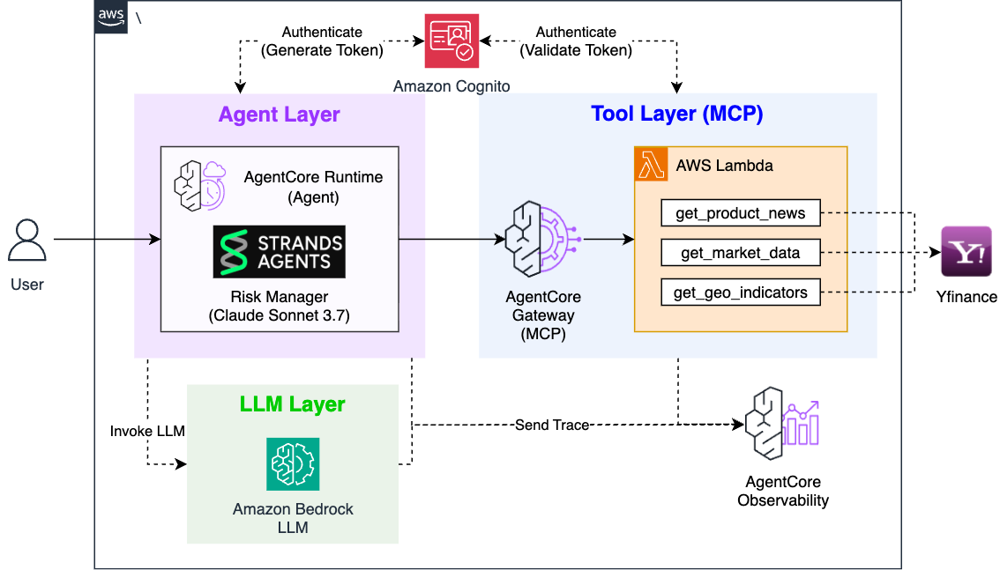

# Risk Manager

AI Risk Manager powered by **AWS Bedrock AgentCore Gateway**.

## 🎯 Overview

An AI agent that analyzes real-time news and macroeconomic data based on Portfolio Architect's portfolio design results to plan risk scenarios and provide portfolio adjustment strategies according to economic conditions.

### Core Features
- **Real-time News Analysis**: Collect latest news for portfolio ETFs and identify risk factors
- **Macroeconomic Indicator Monitoring**: Track major indicators including Dollar Index, Treasury yields, VIX, and oil prices
- **Scenario Planning**: Derive 2 key economic scenarios and establish portfolio adjustment strategies
- **Planning Pattern**: Systematic workflow-based risk analysis and response planning

## 🏗️ Architecture



### Technology Stack
- **AI Framework**: Strands Agents SDK
- **Infrastructure**: AWS Bedrock AgentCore Runtime + Gateway
  - Risk Manager Agent Runtime
  - MCP Gateway (expose Lambda functions as AI tools)
  - Lambda Layer (yfinance library packaging)
  - Lambda Functions (news and macroeconomic data retrieval)
- **LLM**: Claude 3.7 Sonnet (cross region)
- **Data Source**: yfinance (real-time news and market data)
- **Protocol**: MCP (Model Context Protocol)
- **Authentication**: Cognito JWT OAuth2
- **UI**: Streamlit

### Processing Flow


## 🔧 Risk Analysis Process

### 1. Portfolio Analysis
- Analyze input portfolio composition (3 ETFs + allocations)
- Identify characteristics and risk factors of each ETF

### 2. Real-time News Collection
- **get_product_news tool**: Collect latest 5 news articles for each ETF
- Extract title, summary, and publication date information
- Analyze risk factors and market sentiment

### 3. Macroeconomic Indicator Monitoring
- **get_market_data tool**: Real-time retrieval of 7 major economic indicators
  - Interest rates: 2-year/10-year Treasury yields, Dollar Index
  - Volatility/Commodities: VIX, WTI crude oil, gold futures
  - Equity: S&P 500 Index

### 4. Geopolitical Risk Analysis
- **get_geopolitical_indicators tool**: Real-time retrieval of 5 major regional ETFs
  - Asia: China A-shares, Japan, South Korea ETFs
  - Global: Emerging markets, Europe ETFs

### 5. Scenario Development
- **2 Core Scenarios**: Comprehensive analysis of news + macroeconomic + geopolitical factors
- Evaluate probability of occurrence and impact for each scenario

### 6. Portfolio Adjustment Strategy
- **Maintain Existing ETFs**: Adjust only allocations without adding new assets
- Calculate optimal allocation ratios for each scenario
- Provide specific adjustment reasoning and implementation plans

## 🚀 Installation and Setup

### 1. Environment Setup
```bash
# Install dependencies from root folder
cd ..
pip install -r requirements.txt

# Configure AWS credentials
aws configure

# Navigate to risk_manager folder
cd risk_manager
```

### 2. Deployment (4-step sequential deployment required)
```bash
# Step 1: Deploy Lambda Layer (yfinance library)
cd lambda_layer
python deploy_lambda_layer.py

# Step 2: Deploy Lambda function (news/market data retrieval)
cd ../lambda
python deploy_lambda.py

# Step 3: Deploy MCP Gateway (expose Lambda as AI tools)
cd ../gateway
python deploy_gateway.py

# Step 4: Deploy Risk Manager Runtime
cd ..
python deploy.py

# Check deployment status
cat deployment_info.json
```

**⚠️ Note**: Each step must be executed in order, and the next step should only proceed after the previous step is completed.

### 3. Streamlit Demo
```bash
# Run web app
streamlit run app.py

# Access http://localhost:8501 in browser
```

## 📊 Usage

### Input Information (Portfolio Architect Results)
- **Portfolio Allocation**: 3 ETFs and their respective investment weights (%)
- **Portfolio Composition Reasoning**: Investment strategy and ETF selection reasoning
- **Portfolio Evaluation Scores**: Profitability, risk management, diversification (1-10 points)

### Output Results


## 🛠️ Lambda Tools Details

### get_product_news(ticker)
- **Function**: Retrieve latest 5 news articles for specific ETF
- **Data Source**: yfinance API
- **Output**: Title, summary, publication date, link information
- **Purpose**: ETF-specific risk factor and market sentiment analysis

### get_market_data()
- **Function**: Real-time retrieval of major macroeconomic indicators (7 indicators)
- **Indicator Composition**:
  - **Interest Rate Indicators** (3): US 2-year Treasury yield, US 10-year Treasury yield, US Dollar Strength Index
  - **Volatility/Commodities** (3): VIX Volatility Index, WTI crude oil futures price, gold futures price
  - **Equity Index** (1): S&P 500 Index
- **Purpose**: Macroeconomic environment analysis and economic scenario development

### get_geopolitical_indicators()
- **Function**: Real-time retrieval of major regional ETFs (5 regions)
- **Regional Composition**:
  - **China** (ASHR): China A-Shares ETF
  - **Emerging Markets** (EEM): Emerging Markets ETF  
  - **Europe** (VGK): Europe ETF
  - **Japan** (EWJ): Japan ETF
  - **South Korea** (EWY): South Korea ETF
- **Purpose**: Geopolitical risk and regional market condition analysis

## 🔧 Customization

### Model Configuration
```python
# risk_manager.py
class Config:
    MODEL_ID = "us.anthropic.claude-3-7-sonnet-20250219-v1:0"  # Claude 3.7 Sonnet (us region)
    TEMPERATURE = 0.2
    MAX_TOKENS = 4000
```

### Adding/Modifying Market Indicators
```python
# Modify MARKET_INDICATORS dictionary in lambda/lambda_function.py
MARKET_INDICATORS = {
    "new_indicator": {"ticker": "TICKER_SYMBOL", "description": "Indicator description"},
    # ... existing indicators
}
```

## 📁 Project Structure

```
risk_manager/
├── risk_manager.py         # Main agent (AgentCore Runtime)
├── deploy.py               # Risk Manager Runtime deployment (final step of 4)
├── cleanup.py              # System cleanup
├── app.py                  # Streamlit web app
├── requirements.txt        # Python dependencies
├── lambda_layer/           # Lambda Layer (yfinance library)
│   ├── deploy_lambda_layer.py    # Layer deployment script
│   └── layer-yfinance.zip        # yfinance library package
├── lambda/                 # Lambda functions (news/market data retrieval)
│   ├── deploy_lambda.py          # Lambda deployment script
│   └── lambda_function.py        # News and market data retrieval function
└── gateway/                # MCP Gateway (expose Lambda as AI tools)
    ├── deploy_gateway.py         # Gateway deployment script
    └── target_config.py          # MCP tool schema definition
```

## 🔗 Full System Integration

This Risk Manager is the third stage of the **AI Fund Manager** system:

1. **Financial Analyst** → Financial analysis and risk profile assessment
2. **Portfolio Architect** → Real-time ETF data-based portfolio design
3. **Risk Manager** (current) → News analysis and risk scenario planning
4. **Fund Manager** → Full agent integration and final report

The complete system can be run from `../fund_manager/app.py`.